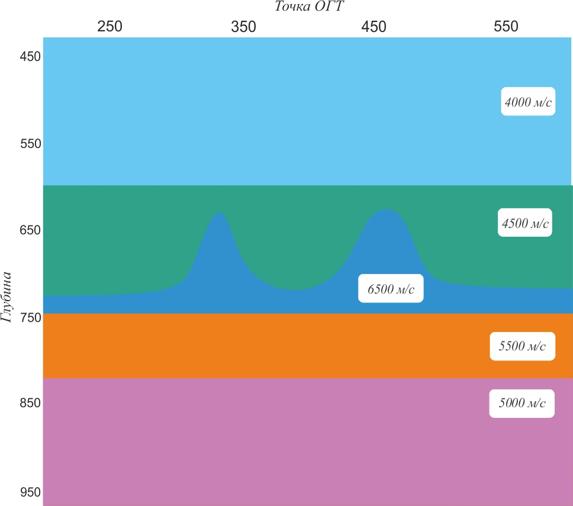
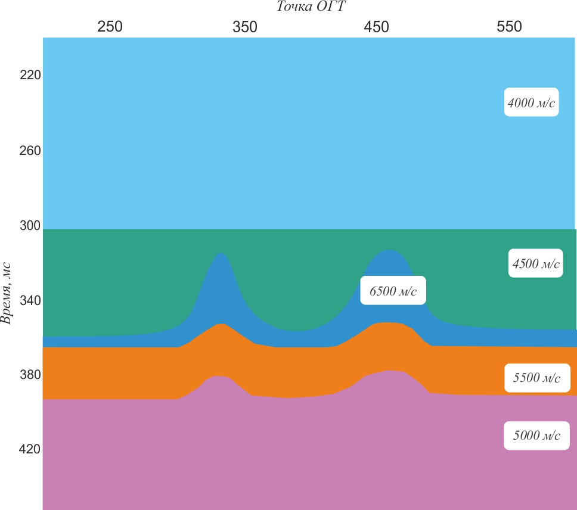
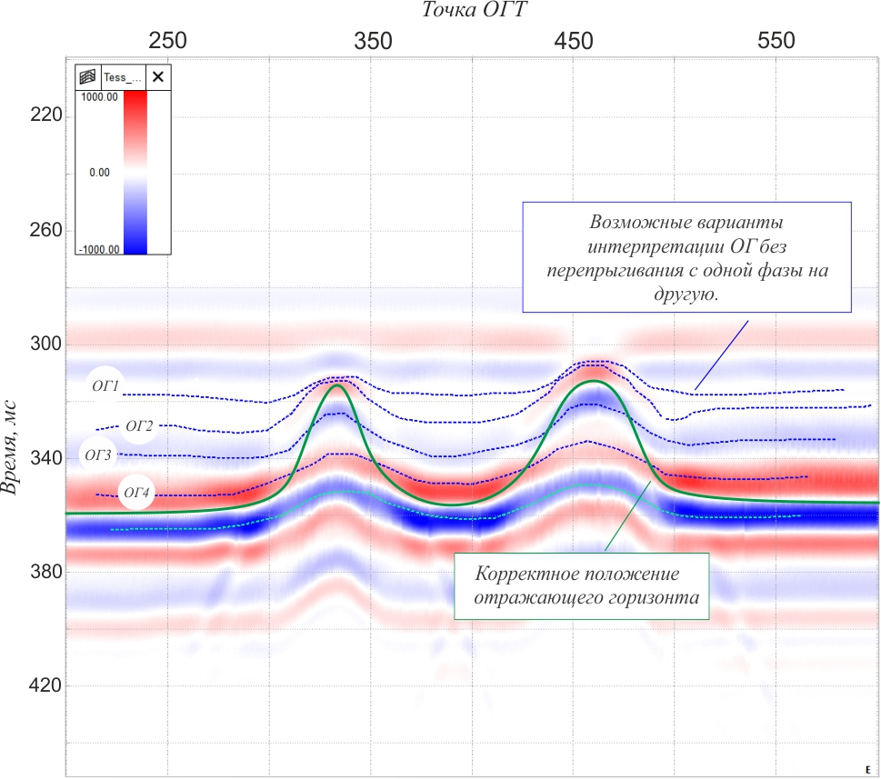

# Надо ли перепрыгивать с одной фазы на другую
Прослеживание отражающих горизонтов по кубам и разрезам сейсмических данных является одним из основных этапов интерпретации.

Чаще всего геофизик придерживается правила фазовой корреляции. В таком случае от трассы к трассе прослеживается один и тот же экстремум отражённой волны. В большинстве случаев такой подход правильный.

Но есть примеры, когда следует допускать переход с одного элемента разреза на другой - перескакивать с фазы на фазу. 

На рисунке ниже приведена модель скоростей имитирующая две органогенные постройки. В горизонтально-слоистый разрез помещены два рифа с относительно высокими скоростями волн.

 

Если эту модель перевести во временной масштаб, то хорошо будет заметно влияние этих рифов на нижележащие границы. Видно, что под рифами границы поднимаются. Такое положение границ как на рисунке ниже можно ожидать на сейсмическом разрезе.

 

Выполнив расчёт сейсмограмм по заданной глубинно-скоростной модели получен следующий временной разрез.

 

Если прослеживать отражающие границы в соответствии с фазовой корреляцией, то можно наметить несколько ОГ - они показаны штриховыми синими линиями. Каждая из этих линий отображает два горба на месте двух рифов.

> Вместе с тем ни одна из этих линий не описывает геометрии рифов так, как она была задана.

Зелёным цветом показано положение кровли органогенных построек полученное непосредственно из модели. 

> **В этом примере не перескакивая с одной фазы на другую нельзя восстановить геометрию рифов.**

